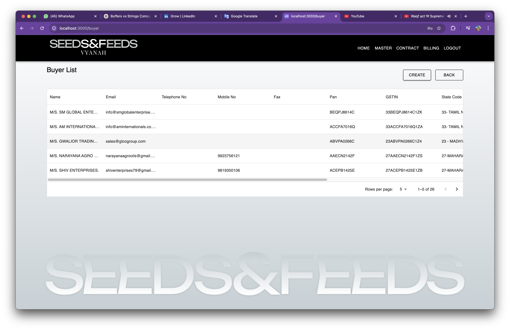
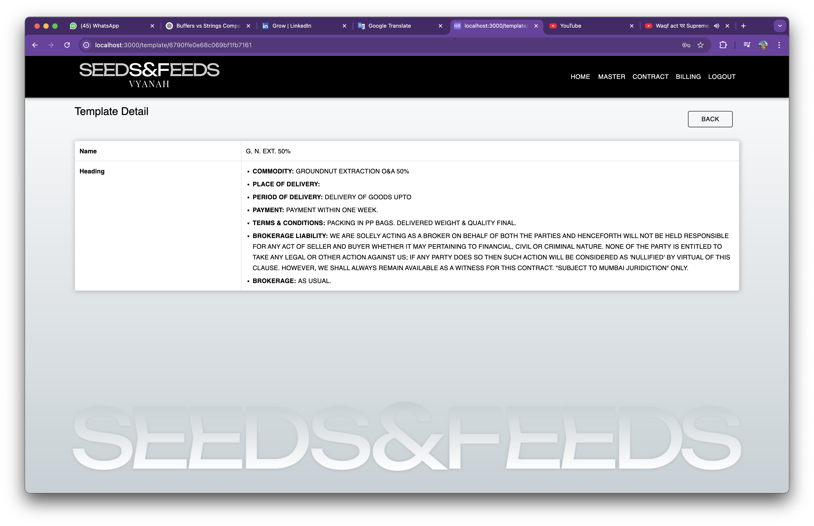

# Seeds & Feeds — Agri-Commodity Contract & Billing Management

**Seeds & Feeds** is a full-stack web application built using **Next.js** and deployed on **AWS**.  
It streamlines contract creation, seller/buyer management, billing, and reporting for agri-commodity trading brokers, automating paperwork and improving operational efficiency.

## 🌟 Features

- **User Authentication**  
  Secure login interface for authorized users.

- **Sellers & Buyers Management**  
  - CRUD operations on sellers and buyers.
  - Detailed records including contact info, PAN, GSTIN, state code, account details.

- **Templates Management**  
  - Create, edit, and manage contract templates with dynamic labels and values (e.g., commodity, delivery terms, payment terms).
  - Reusable for contracts.

- **Contract Management**  
  - Auto-generated contract numbers.
  - CRUD operations on contracts linking sellers, buyers, templates.
  - Downloadable PDF of contracts.
  - Send contracts via email directly from the app.

- **Billing Management**  
  - Generate and manage bills linked to contracts.
  - Auto-generated billing numbers.
  - GST, SGST, CGST, IGST, brokerage calculations.
  - Billing reports with date filters.

- **Reports & Export**  
  - Billing reports with detailed tax breakdown.
  - Download reports as PDF.

---

## ⚙️ Tech Stack

- **Frontend:** Next.js  
- **Backend:** Node.js / Express (if applicable)  
- **Database:** MySQL (or the DB you’re using — update accordingly)  
- **Deployment:** AWS (EC2 / RDS / S3 — update specifics if needed)  
- **Other:**  
  - PDF generation (e.g., using libraries like `pdfkit` or `html-pdf`)  
  - Email service (e.g., Nodemailer or SES)

---

## 🚀 Deployment

This application is deployed on **AWS**, leveraging:
- **EC2** for hosting the app  
- **RDS** (or equivalent) for database  
- **S3** (if any static assets or backups used)

---

## 📸 Screenshots

| Screenshot | Description |
|------------|-------------|
|  | Login page |
|  | Main dashboard with navigation |
|  | Master Page with navigation |
|  | Seller management list |
|  | Seller management create |
|  | Seller management edit |
|  | Seller management detail |
|  | Buyer management list |
|  | Buyer management edit |
|  | Buyer management create |
|  | Template management list |
|  | Template management create |
|  | Template management edit |
|  | Template management detail |
|  | Contract management list |
|  | Contract management create |
|  | Contract management edit |
|  | Contract management detail |
|  | Contract management preview |
|  | Billing management list |
|  | Billing management create |
|  | Billing management edit |
|  | Billing management report |

## 🛠️ Setup & Installation

```bash
# Clone the repository
git clone https://github.com/yourusername/seeds-feeds.git
cd seeds-feeds

# Install dependencies
npm install

# Setup environment variables (DB config, AWS keys, etc.)

# Run the app
npm run dev


## 📬 Contact

**Author:** Ajay M Vishwakarma  
**Email:** ajayvishwakarma457@gmail.com
